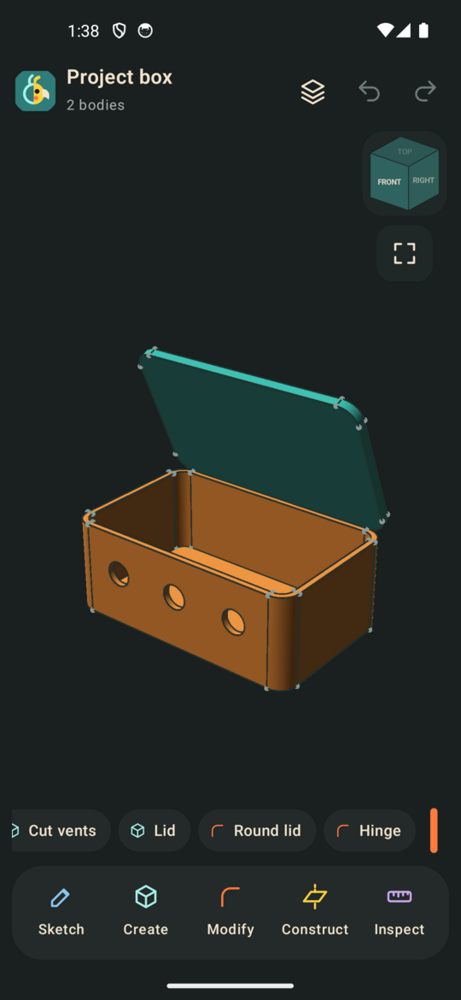
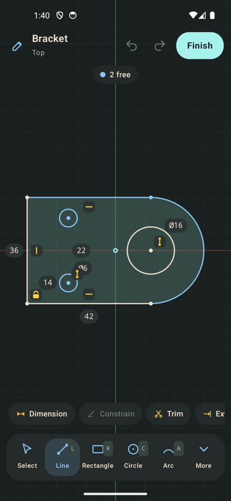
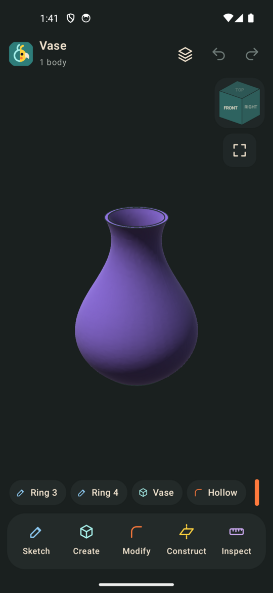
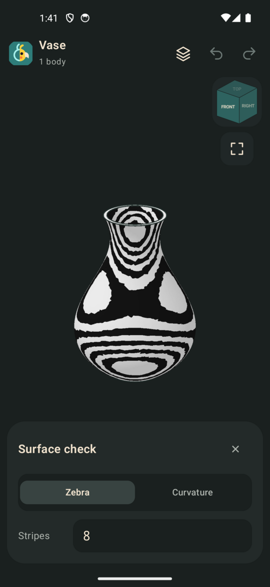
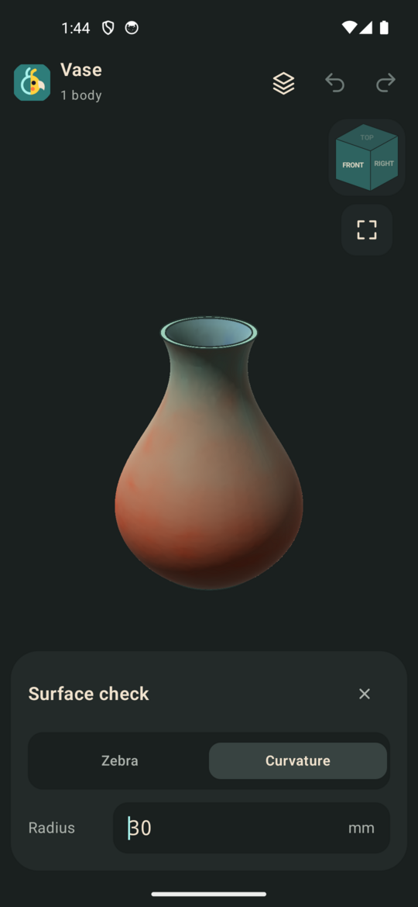
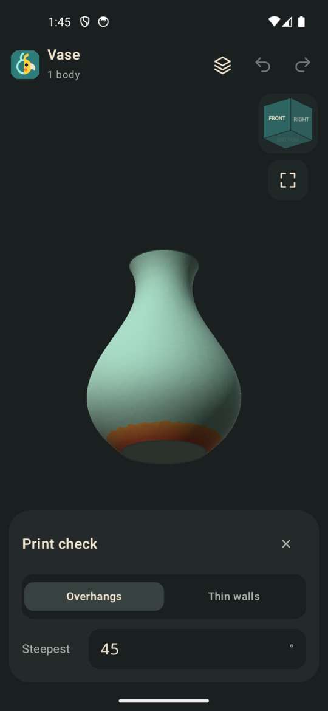

# ParrotMetric

ParrotMetric is a parametric 3D modeller for Android 8.1 and up.
It also runs on Linux, on Windows and in a web browser.

You draw sketches with constraints and dimensions, turn them into solids with extrude, revolve, sweep, loft and the rest, then round, cut, shell, pattern and join them into parts. Every step stays in the history, so you can go back and change an early one and everything after it rebuilds. For organic shapes there's sculpting too.

It's made for designing things to 3D print. It works by touch first, but it also has proper mouse and keyboard controls for when you're at a desk. Everything runs on the device. The only time it goes online is if you give it a WebDAV server to keep your designs on.

It's at 0.5.1. It's usable for real parts, but it isn't finished and there will be rough edges. Let me know what works, what doesn't, and what you'd like it to do.

There's a manual in [manual/](manual/README.md), and the same words are under Help in the app.

Please join me in the #parrotmetric channel **[on my discord](https://discord.gg/9Wun47jGC6)** to share what you've made, ask questions, report bugs or problems with different devices, or ask for new features. Or feel free to open an issue here.

Enjoy!
Dan

---

## Screenshots

<table>
  <tr>
    <td align="center"></td>
    <td align="center"></td>
    <td align="center"></td>
  </tr>
  <tr>
    <td align="center"></td>
    <td align="center"></td>
    <td align="center"></td>
  </tr>
</table>

The box has rounded corners, a hollow, vents and a lid on a hinge joint, with its sizes as parameters. The vase is a loft through four rings, hollowed out.

---

## What's in it

### Sketching

- Lines, rectangles (corner to corner, from the centre, or three points), circles (centre, two points, three points), arcs (centre and ends, three points, tangent), points, polygons, slots, ellipses, conics and splines (through points, or pulled by control points)
- Text in a sketch, regular or bold, that extrudes like any other shape
- SVG and DXF drawings brought into a sketch, and pictures laid on a plane as a canvas to trace over
- Constraints: coincident, horizontal, vertical, parallel, perpendicular, tangent, equal, fixed, midpoint, symmetric, concentric and collinear, many of them added as you draw
- Dimensions for lengths, distances, radii, diameters and angles, typed as numbers or as expressions that use your parameters
- A count of how much is still free to move, and colours for what's fully set
- Trim, extend, break, offset, round corner and cut corner
- Mirror across a line (and stay mirrored), move, scale, and pattern in a row or round a point
- Project a face's edges into a sketch, or where the bodies cross the sketch's plane

### Making solids

- Extrude: a distance, both ways, two different ways, up to a face, through everything, with a taper, from an offset, or as a thin wall
- Revolve round a line or an axis
- Sweep along a path, Loft through several sketches (twisted, or following a guide), Pipe along a path, and Coil
- Gears, straight, helical or herringbone, placed to mesh with each other
- Box, cylinder, sphere, torus and cone, without a sketch
- Each one can make a new body, or join, cut or intersect with what it touches
- Insert other designs as components, kept up to date from their files, with a bill of materials and an exploded view

### Changing them

- Fillet (one radius, from one radius to another, or a set width across) and chamfer (equal, two distances, or a distance and an angle)
- Shell, draft, press pull and delete face
- Holes (plain, counterbore and countersink) and threads, metric or UNC, modelled or only drawn
- Standard screws, nuts and washers that go in a hole, metric or inch
- Rib and web, grown from an open line until they meet the body
- Emboss, to raise or sink sketch areas into a face, flat or curved, so text and shapes follow a round part
- Mirror and pattern (in a row, in a grid, round an axis or along a path), of bodies or of the steps that made them
- Combine, split by a plane or a body, move, scale and align

### Construction

- Planes: offset, angled, midway, through three points, through two edges, tangent to a cylinder, and along an edge
- Axes and points from edges, faces, corners and planes

### Meshes

- STL, 3MF and OBJ files come in as mesh bodies and get repaired on the way in
- Cut them, join and cut them with solids, sketch on their flat areas, and turn small ones into solids
- Reduce, remesh and smooth

### Sculpting

- Sculpt any body, or start from a ball or a block, like clay
- Draw, Clay, Crease, Smooth, Flatten, Inflate, Pinch, Grab, Pull, Layer and Mask brushes
- Mirror across X, Y and Z, detail added under the brush as you work, steady lines and pen pressure
- Kept as a step in the history with its mask; change an earlier step and the strokes are made again on the changed body
- Shown as clay, stone, porcelain or terracotta, with its triangles if you like, and exported like any mesh

### Surfaces

- Patch sketch areas into surfaces, or fill a gap from a loop of edges
- Stitch surfaces together, into a solid if they close up
- Thicken a surface into a solid, and trim one with Split

### Components and joints

- Group bodies into components in the parts list, and name, colour and hide them
- Joints that turn, slide or do both, with a slider to move them, and rigid joints that keep components together

### Checking a part

- Measure distances, angles, areas, volume, centre of mass, and the weight in PLA, PETG, ABS and a few others
- Section view, cut through on any plane
- Print check, which shows overhangs past a set angle and walls thinner than a set thickness
- Surface check, which shows zebra stripes and curvature
- Interference, to find where bodies overlap

### Drawings

- A sheet of views of the part: front, top, side and isometric, with hidden lines dashed, third or first angle
- Section views, hatched, with the cutting line on the other views
- Dimensions between corners, diameters and radii, and hole callouts, that follow the part when it changes
- Notes and a title block, on A4, A3, A2, Letter or Tabloid at a standard scale
- Saved as PDF to print at true size, DXF for laser cutters, or SVG

### Parameters and configurations

- Named parameters that any number field can use, so changing one changes everything that uses it
- Configurations, which keep sets of parameter values and switched-off steps under a name so you can flip between versions of a part

### Files

- Its own design files (.pmet), which keep the whole history
- Export to STL, 3MF (with colours), OBJ, STEP and IGES, per body or all together, at coarse, medium or fine detail
- Open the part straight in Bambu Studio, OrcaSlicer, PrusaSlicer or Cura on a computer, or share it on Android
- Import STEP and IGES as solids you can keep working on
- A projects folder, so your designs are the same on every device: a folder a sync app looks after (Nextcloud, Syncthing and the like), or a folder on a WebDAV server such as Nextcloud. If a design was changed in two places at once, both versions are kept
- Autosave every 30 seconds, and whenever it goes to the background or closes, so a crash or a phone call doesn't lose your work

### Controls

- Touch: one finger turns the view, two pan and pinch to zoom, double tap fits everything, and a long press on a step in the history for its menu
- Mouse: middle drag pans, Shift and middle drag or right drag turns, the wheel zooms to the pointer, left drag box-selects (left to right picks what's inside, right to left picks anything it touches), right click for a menu with Repeat
- Keyboard: a letter for most tools, Ctrl (or Alt) for file and edit, Esc or Backspace to back out, digits go into the first field, Tab moves between fields and Enter finishes. Press S to search for a tool and ? for the list of keys. Key badges show on the buttons when a keyboard is attached
- Two layouts, one for phones and one for tablets, desktop and the browser, picked by the window size or set in Settings
- Display detail set from a quick speed test the first time it runs, so it stays smooth on older devices (it runs well on a Fire HD 8), and you can change it in Settings

---

## Keeping designs in sync

In Settings, under Projects folder, either choose a folder that a sync app keeps up to date, or enter a WebDAV server. Designs you make are saved there as .pmet files, and the start screen lists what's in it. When you come back to the app, it loads a newer copy if another device has changed the one you have open.

For Nextcloud, the folder address looks like `https://your.server/remote.php/dav/files/USERNAME/ParrotMetric/` (make the folder first), and it's best to use an app password from Nextcloud's security settings.

The browser version can only use a server that allows requests from the page's address (CORS). Most don't by default.

---

## Getting it

Each release has:

| File | For |
|---|---|
| parrotmetric-0.5.1-64bit.apk | Most Android phones and tablets |
| parrotmetric-0.5.1-32bit.apk | Older 32-bit devices, like the Fire HD 8 |
| parrotmetric_0.5.1_amd64.deb | Debian, Ubuntu and the like on a PC |
| parrotmetric_0.5.1_arm64.deb | Raspberry Pi OS (64-bit) and other arm64 Linux |
| parrotmetric-0.5.1-x86_64.AppImage | Any recent Linux on a PC |
| parrotmetric-0.5.1-aarch64.AppImage | Any recent arm64 Linux |
| parrotmetric-0.5.1-setup.exe | 64-bit Windows, installed |
| parrotmetric-0.5.1-windows-x64.zip | Windows, without installing |
| parrotmetric-0.5.1-web.tar.gz | The browser version, to put on any web server |

The AppImages and the Windows builds bring their own Java. The .deb packages use the system's Java 21, which your package manager pulls in.

---

## Building

Get the submodules first:

    git submodule update --init --depth 1

Each target builds Open CASCADE for itself the first time, which takes a while. It's kept in core/build/occt and reused after that.

Android, 64-bit (arm64), and with -Parm32 the 32-bit build (armv7). Debug builds add x86_64 or x86, for emulators:

    ./gradlew :app:assembleRelease
    ./gradlew :app:assembleRelease -Parm32

Release builds are signed with the key named in ../Keys/parrotmetric-keystore.properties, when there is one.

Desktop, on the machine you're on:

    ./gradlew :desktop:run

The packages are built in Docker containers (desktop/native/Dockerfile.*):

    ./gradlew :desktop:debAmd64 :desktop:debArm64
    ./gradlew :desktop:appImageAmd64 :desktop:appImageArm64
    ./gradlew :desktop:windowsX64

The browser build needs Emscripten (emsdk, in ~/.local/share/emsdk or wherever EMSDK says):

    ./gradlew :webApp:wasmJsBrowserDistribution

The page ends up in web/app/build/dist/wasmJs/productionExecutable. If you change NativeCore.kt, run web/core/gen_bridge.py to update the browser's side of the calls.

The core's tests run on the build machine:

    core/scripts/build-occt.sh host
    cmake -S core -B core/build/host -G Ninja -DPM_TESTS=ON
    cmake --build core/build/host
    ctest --test-dir core/build/host

and the rest with:

    ./gradlew :model:jvmTest :shared:desktopTest

---

## Thanks

ParrotMetric stands on a lot of other people's work. The modelling is all theirs underneath; I just put a front on it.

- **[Open CASCADE Technology](https://dev.opencascade.org/)** 8.0.1 does the solid modelling: booleans, fillets, sweeps, offsets, STEP and IGES, and the meshing for display and export. LGPL 2.1 with the Open CASCADE exception.
- **[Manifold](https://github.com/elalish/manifold)** 3.5.4 does the mesh bodies and their booleans, and the reduce and smooth tools. Apache 2.0.
- **[Eigen](https://eigen.tuxfamily.org/)** 5.0.1 does the maths in the sketch solver. MPL 2.0.
- **[zlib](https://zlib.net/)** 1.3.1 reads and writes 3MF files on desktop and in the browser. zlib licence.
- **[stb_truetype and stb_image](https://github.com/nothings/stb)** by Sean Barrett turn fonts into outlines and read pictures for canvases. MIT or public domain.
- **[Noto Sans](https://fonts.google.com/noto/specimen/Noto+Sans)** is the font for text in sketches. SIL Open Font License 1.1.
- **[Catch2](https://github.com/catchorg/Catch2)** runs the core's tests (not part of the app). Boost Software License.
- The OpenGL ES and EGL headers are the **[Khronos Group](https://www.khronos.org/)**'s, under the MIT and Apache 2.0 licences in each file.
- The app is written in **[Kotlin](https://kotlinlang.org/)** with **[Compose Multiplatform](https://www.jetbrains.com/compose-multiplatform/)** by JetBrains, and uses AndroidX and kotlinx.coroutines (Apache 2.0).
- **[OkHttp](https://square.github.io/okhttp/)** by Square talks to WebDAV servers in the Android app. Apache 2.0.
- The browser build is made with **[Emscripten](https://emscripten.org/)** and **[Binaryen](https://github.com/WebAssembly/binaryen)**.

Their licences are in [licences/](licences/), and their sources are in third_party/ as git submodules, apart from stb and the fonts, which are kept in the repository. If you got ParrotMetric as an app, the same licences come with it.

---

## Licence

ParrotMetric is under the GPL 3. See [LICENSE](LICENSE).

Disclaimer: I am not a great programmer so this was made using Claude Opus 5.5
